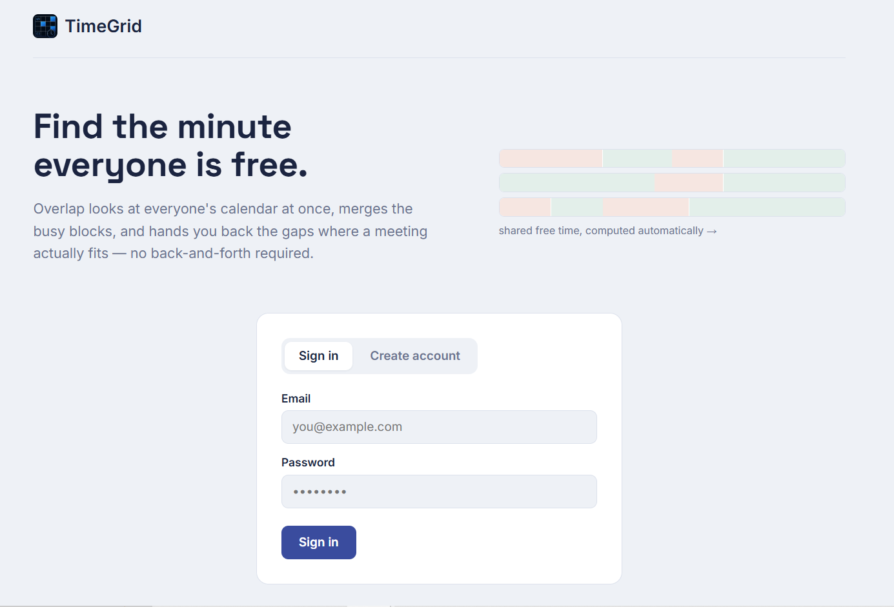
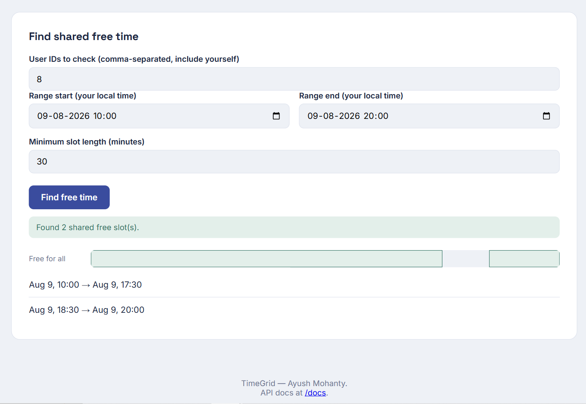

# TimeGrid

**Find the minute everyone is free.** A scheduling API and web app that looks at
multiple people's calendars at once, merges their busy time, and returns the
gaps where a meeting actually fits — without anyone double-booking themselves.

**Live demo:** https://mohantybabu2002-design.github.io/smart-event-scheduler/
**API docs:** https://smart-event-scheduler.onrender.com/docs

> Built by [Ayush Mohanty](https://github.com/mohantybabu2002-design) as a
> portfolio project to demonstrate backend API design, database modeling,
> and interval-based algorithms.

---

## Screenshots

<!--
  Drop 2-3 PNG screenshots of the live TimeGrid app into a /screenshots
  folder in this repo, then update the paths below to match. Good ones to grab:
  1. The landing/sign-in page
  2. The dashboard with an event created
  3. The "Find shared free time" panel showing the timeline visualization
-->

| Landing page | Shared free-time finder |
|---|---|
|  |  |

---

## What it does

- **Sign up / log in** with secure, hashed passwords and JWT-based auth
- **Create events** and invite other users — the system checks everyone's
  schedule and rejects the request with a clear conflict if anyone's already
  busy
- **Find shared free time** across a group of people: give it a list of user
  IDs and a time window, and it returns every gap long enough for a meeting,
  visualized as a timeline

## Why this project

Most beginner portfolio projects are CRUD apps with no real logic behind
them. TimeGrid was built to demonstrate an actual algorithmic problem
(interval scheduling) wired into a real, working product — API, database,
auth, frontend, and deployment, not just a script.

## Tech stack

| Layer | Choice |
|---|---|
| Backend | FastAPI (Python) |
| Database | PostgreSQL + SQLAlchemy |
| Auth | JWT (python-jose) + bcrypt password hashing |
| Frontend | Plain HTML / CSS / JavaScript (no framework) |
| Backend hosting | Render |
| Frontend hosting | GitHub Pages |

## The core algorithm

The standout feature — finding common free time — works in three steps:

1. **Collect busy time** for every user in the group, across all their events
   (as host or invited participant).
2. **Merge overlapping busy intervals** into a clean, non-overlapping list —
   the classic "merge intervals" problem.
3. **Walk the gaps** between merged busy blocks. Whatever's left over, above
   a minimum duration, is free for the whole group.

Double-booking prevention uses the same underlying idea in reverse: before
saving a new event, the system checks whether it overlaps any existing event
for the host or any invited participant, using the standard interval-overlap
rule:

```
two ranges [startA, endA) and [startB, endB) overlap if:
    startA < endB AND startB < endA
```

All times are stored in UTC in the database. The frontend converts to and
from the browser's local timezone automatically, so a person typing "6 PM"
gets exactly what they mean, regardless of where they are.

See [`app/scheduling.py`](app/scheduling.py) for the implementation.

## Data model

| Table | Purpose |
|---|---|
| `users` | Account info, hashed password, timezone |
| `events` | A meeting: host, title, start/end time (UTC) |
| `participants` | Links events to invited users, with accept/decline status |

## API endpoints

| Method | Path | Description |
|---|---|---|
| POST | `/signup` | Create an account |
| POST | `/login` | Log in, get a JWT |
| GET | `/me` | Get the current logged-in user (requires token) |
| POST | `/events` | Create an event, with conflict checking |
| GET | `/events` | List events you're hosting or invited to |
| GET | `/events/{id}` | Get one event |
| POST | `/events/find-common-free-slots` | Find shared free time across a group |

Full interactive documentation (try every endpoint live) is at
[`/docs`](https://smart-event-scheduler.onrender.com/docs).

## Running it locally

1. Install PostgreSQL locally and create a database called `scheduler`.
2. Set up the environment:
   ```bash
   python -m venv venv
   source venv/bin/activate   # Windows: venv\Scripts\activate
   pip install -r requirements.txt
   ```
3. Copy `.env.example` to `.env` and fill in your real database password and
   a secret key.
4. Run the server:
   ```bash
   uvicorn app.main:app --reload
   ```
5. Open **http://127.0.0.1:8000/docs** to try the API directly, or open
   `frontend/index.html` in a browser (update `API_BASE` at the top of its
   `<script>` tag to `http://127.0.0.1:8000` first).

## What's next

- Automated tests (pytest) covering the overlap and timezone edge cases
- Accept/decline flow for invited participants
- Invite by email instead of raw user ID
- Delete/update events

## Author

**Ayush Mohanty** — [GitHub](https://github.com/mohantybabu2002-design)
